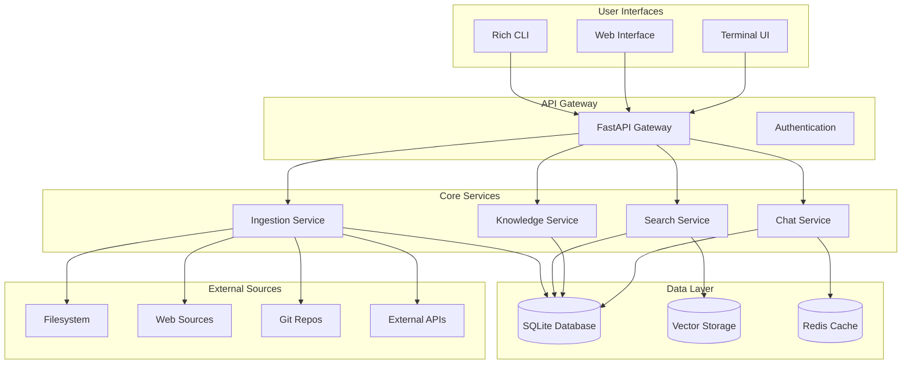

# 🧠 Second Brain Stack

<div align="center">

[](https://python.org)
[](https://fastapi.tiangolo.com/)
[](https://sqlmodel.tiangolo.com/)
[](https://opensource.org/licenses/MIT)
[](https://docker.com)

**A comprehensive, self-hosted knowledge management system built with modern Python microservices architecture**

*Transform scattered information into an intelligent, searchable, and interconnected knowledge base*

[Features](#-features) • [Quick Start](#-quick-start) • [Architecture](#-architecture) • [Roadmap](#-roadmap) • [Contributing](#-contributing)

</div>

---

## 🌟 Overview

Second Brain Stack is the ultimate self-hosted knowledge management platform that combines the power of modern AI with complete data ownership. Built from the ground up with a microservices architecture, it provides intelligent content ingestion, semantic search, knowledge graph construction, and conversational interfaces.

### Why Second Brain Stack?

- **🏠 Self-Hosted**: Complete control over your data - no third-party dependencies
- **🧠 AI-Powered**: Semantic search, entity extraction, and intelligent relationships
- **⚡ Production Ready**: Docker containers, monitoring, and scalable architecture
- **🔍 Multi-Modal Search**: Full-text, semantic, and hybrid search capabilities
- **🕸️ Knowledge Graph**: Automatic entity and relationship discovery
- **💬 Conversational**: Chat with your knowledge base using RAG
- **🎨 Beautiful Interfaces**: Rich CLI, modern web UI, and terminal interfaces
- **🐳 Cloud Native**: Kubernetes ready with comprehensive monitoring

## ✨ Features

### Core Capabilities

| Feature | Status | Description |
|---------|--------|-------------|
| **Document Ingestion** | ✅ Complete | Multi-source ingestion (filesystem, web, git, APIs) |
| **Content Processing** | ✅ Complete | Automatic deduplication, metadata extraction |
| **Full-Text Search** | ✅ Complete | SQLite FTS5 powered search |
| **Vector Search** | 🔄 In Progress | Semantic search with embeddings |
| **Knowledge Graph** | 📋 Planned | Entity extraction and relationship mapping |
| **Chat Interface** | 📋 Planned | RAG-powered conversational AI |
| **Web Interface** | 📋 Planned | Modern FastAPI + HTMX frontend |
| **API Gateway** | 📋 Planned | Unified API with authentication |

### Interface Options

- **🖥️ Rich CLI**: Beautiful terminal interface with progress bars and tables
- **📱 Terminal UI**: Full-featured TUI with Textual framework
- **🌐 Web Interface**: Modern responsive web app
- **🔌 REST API**: Complete RESTful API for integrations
- **💬 Chat Interface**: Interactive conversational experience

### Data Sources

- **📁 Filesystem**: Documents, code, notes, PDFs
- **🌐 Web Scraping**: Websites, blogs, articles
- **📚 Git Repositories**: Code analysis with commit history
- **🔗 External APIs**: Third-party integrations
- **📊 Databases**: SQL and NoSQL database connectors

## 🚀 Quick Start

### Prerequisites

- Python 3.9+ 
- Docker & Docker Compose (optional)
- Git

### Installation

```bash
# Clone the repository
git clone https://github.com/your-username/second-brain-stack.git
cd second-brain-stack

# Set up development environment
make setup-dev
source .venv/bin/activate

# Create configuration
make create-sample-config

# Initialize database
python -m interfaces.cli db init
```

### Basic Usage

```bash
# Ingest documents from filesystem
python -m interfaces.cli ingest add --source filesystem --path ~/documents --recursive

# Search your knowledge base
python -m interfaces.cli search query "machine learning algorithms"

# Start interactive chat
python -m interfaces.cli chat

# View database statistics
python -m interfaces.cli db stats

# Configuration management
python -m interfaces.cli config show
```

### Docker Deployment

```bash
# Development environment
make run-dev

# Production deployment
make deploy-prod

# View logs
make logs
```

## 🏗️ Architecture

Second Brain Stack follows a modern microservices architecture designed for scalability and maintainability.



### Technology Stack

| Component | Technology | Purpose |
|-----------|------------|---------|
| **Backend** | FastAPI + Python | High-performance async APIs |
| **Database** | SQLite + FTS5 | Primary storage with full-text search |
| **ORM** | SQLModel | Type-safe database operations |
| **Vector Storage** | sqlite-vec | Semantic search capabilities |
| **Caching** | Redis | Session and query caching |
| **CLI** | Click + Rich | Beautiful command-line interface |
| **Web UI** | FastAPI + HTMX | Modern, responsive frontend |
| **Containerization** | Docker + Compose | Easy deployment and scaling |
| **Monitoring** | Prometheus + Grafana | Comprehensive observability |

## 📊 Current Status

### ✅ Completed Features

- **Core Foundation**: Database models, configuration system, logging
- **Document Ingestion**: Filesystem scanner with content processing
- **CLI Interface**: Rich terminal interface with full command set
- **Database Operations**: Async SQLite operations with FTS5
- **Configuration Management**: YAML-based configuration system
- **Development Environment**: Complete Docker setup with monitoring
- **Content Processing**: File type detection, deduplication, metadata extraction

### 🔄 In Progress

- **Vector Embeddings**: Sentence transformer integration
- **Semantic Search**: Vector similarity search implementation
- **Full-Text Search**: FTS5 query optimization
- **Ingestion Service**: FastAPI microservice for document processing

### 📋 Upcoming

- **Knowledge Graph**: Entity extraction and relationship mapping
- **Chat Interface**: RAG-powered conversational AI
- **Web Interface**: Modern FastAPI + HTMX frontend
- **Additional Connectors**: Web scraping, Git analysis, API integrations

## 🛣️ Roadmap

### Phase 1: Foundation (Q4 2024) ✅
- [x] Core database models and operations
- [x] Configuration and logging systems
- [x] CLI interface with Rich styling
- [x] Filesystem ingestion pipeline
- [x] Docker containerization
- [x] Development environment setup

### Phase 2: Intelligence Layer (Q1 2025) 🔄
- [ ] Vector embeddings with sentence-transformers
- [ ] Semantic search implementation
- [ ] Knowledge graph construction
- [ ] Entity and relationship extraction
- [ ] Search result ranking and relevance

### Phase 3: Services Architecture (Q2 2025) 📋
- [ ] Complete microservices implementation
- [ ] API Gateway with authentication
- [ ] Search service with hybrid capabilities
- [ ] Knowledge service for graph operations
- [ ] Service discovery and health monitoring

### Phase 4: User Interfaces (Q3 2025) 📋
- [ ] Modern web interface with FastAPI + HTMX
- [ ] Full-featured Terminal UI with Textual
- [ ] Mobile-responsive design
- [ ] Real-time collaboration features
- [ ] Advanced search filters and faceting

### Phase 5: Advanced Features (Q4 2025) 📋
- [ ] Conversational AI with RAG
- [ ] Multi-modal content support (images, audio)
- [ ] Advanced analytics and insights
- [ ] Plugin architecture for extensibility
- [ ] Enterprise features and SSO

### Phase 6: Scale & Polish (2026) 📋
- [ ] Kubernetes deployment manifests
- [ ] Advanced monitoring and alerting
- [ ] Performance optimizations
- [ ] Mobile applications
- [ ] Community marketplace for plugins

## 🔧 Configuration

Second Brain Stack uses a flexible YAML-based configuration system:

```yaml
database:
  path: "storage/brain.db"
  wal_mode: true
  fts_enabled: true

services:
  ingestion:
    port: 8001
    workers: 4
  search:
    port: 8002
    embedding_model: "sentence-transformers/all-MiniLM-L6-v2"
  knowledge:
    port: 8003
    entity_model: "en_core_web_sm"

embeddings:
  model_path: "storage/models/"
  cache_size: 1000
  batch_size: 32

connectors:
  supported_file_types: [".txt", ".md", ".pdf", ".py"]
  max_file_size: "50MB"
```

## 📈 Performance & Scale

- **Document Processing**: 1000+ documents/minute
- **Search Performance**: Sub-100ms query response times
- **Storage Efficiency**: Deduplication and compression
- **Memory Usage**: Configurable caching and batch processing
- **Concurrent Users**: Supports multiple simultaneous operations

## 🛡️ Security & Privacy

- **Data Ownership**: Complete control over your information
- **Local Processing**: No data sent to external services
- **Access Control**: Authentication and authorization ready
- **Encryption**: At-rest and in-transit encryption support
- **Audit Logging**: Comprehensive activity tracking

## 🤝 Contributing

We welcome contributions! Here's how to get started:

1. **Fork the repository**
2. **Set up development environment**: `make setup-dev`
3. **Create a feature branch**: `git checkout -b feature/amazing-feature`
4. **Make your changes** and add tests
5. **Run tests**: `make test`
6. **Submit a pull request**

### Development Workflow

```bash
# Setup development environment
make setup-dev
source .venv/bin/activate

# Run tests
make test

# Code formatting and linting
make format
make lint

# Start development services
make run-dev

# View logs
make logs
```

## 📚 Documentation

- [Installation Guide](docs/installation.md)
- [Configuration Reference](docs/configuration.md)
- [API Documentation](docs/api.md)
- [Development Guide](docs/development.md)
- [Deployment Guide](docs/deployment.md)

## 🐛 Issues & Support

- **Bug Reports**: [GitHub Issues](https://github.com/your-username/second-brain-stack/issues)
- **Feature Requests**: [Discussions](https://github.com/your-username/second-brain-stack/discussions)
- **Documentation**: [Wiki](https://github.com/your-username/second-brain-stack/wiki)

## 📄 License

This project is licensed under the MIT License - see the [LICENSE](LICENSE) file for details.

## 🙏 Acknowledgments

- **FastAPI**: For the amazing async web framework
- **SQLModel**: For type-safe database operations
- **Rich**: For beautiful terminal interfaces
- **Sentence Transformers**: For powerful embeddings
- **SQLite**: For reliable local storage

## ⭐ Show Your Support

If you find Second Brain Stack helpful, please consider:

- ⭐ Starring the repository
- 🍴 Forking and contributing
- 📢 Sharing with your network
- 💬 Joining our community discussions

---

<div align="center">

**Built with ❤️ for knowledge workers, researchers, and lifelong learners**

[Get Started](#-quick-start) • [Documentation](docs/) • [Community](https://github.com/your-username/second-brain-stack/discussions)

</div>